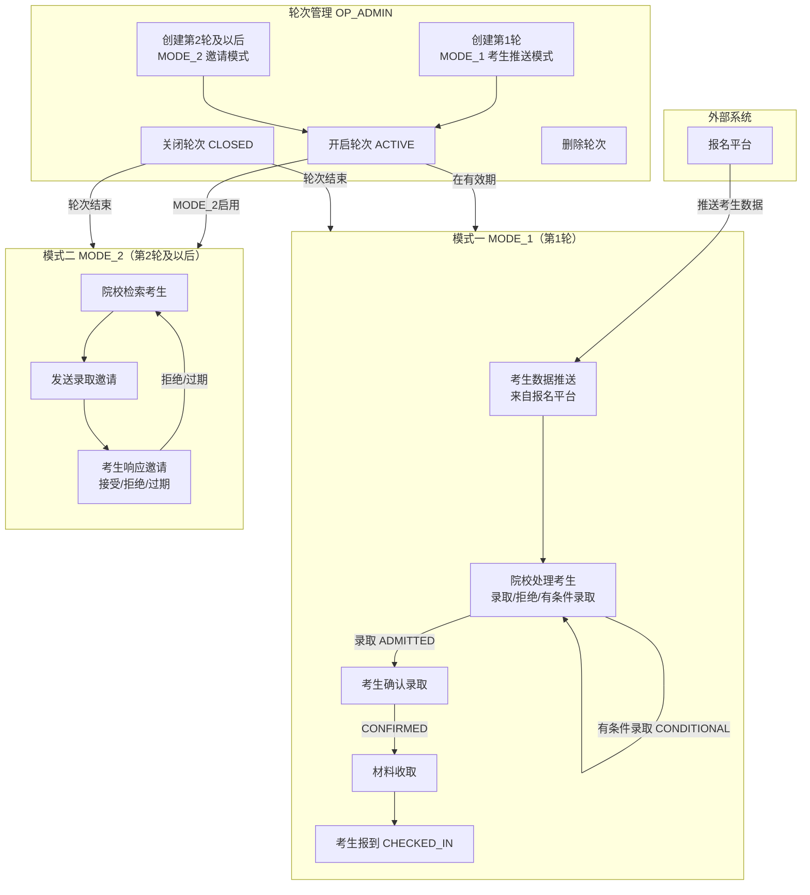
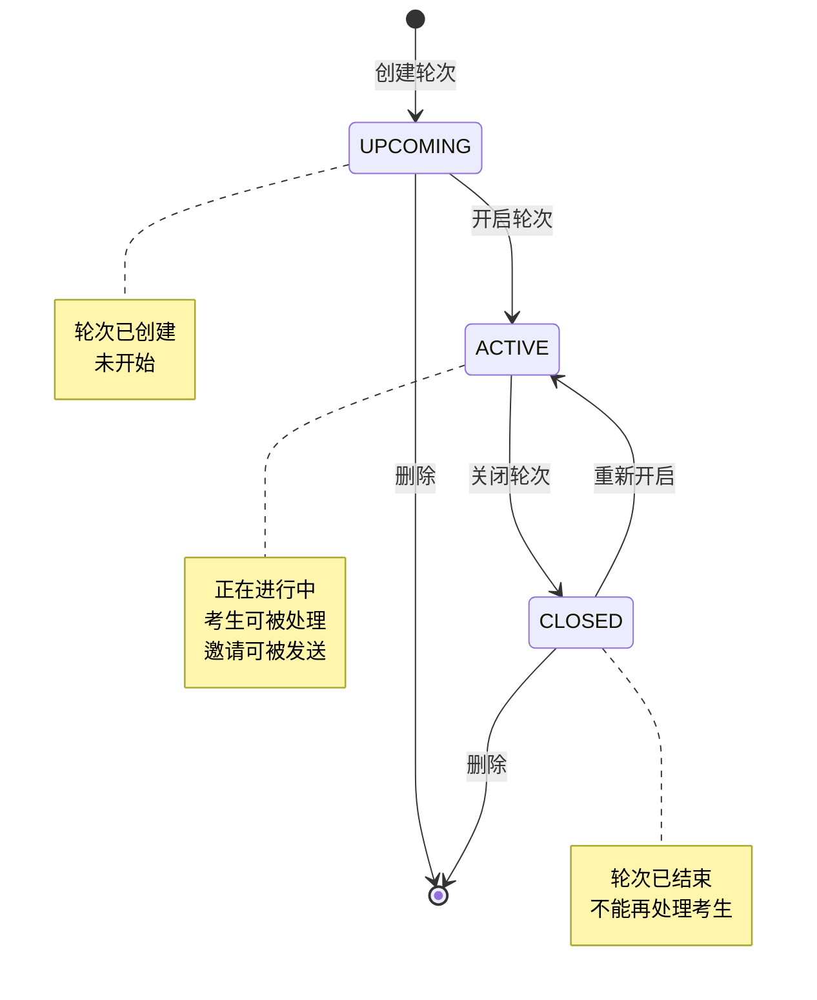
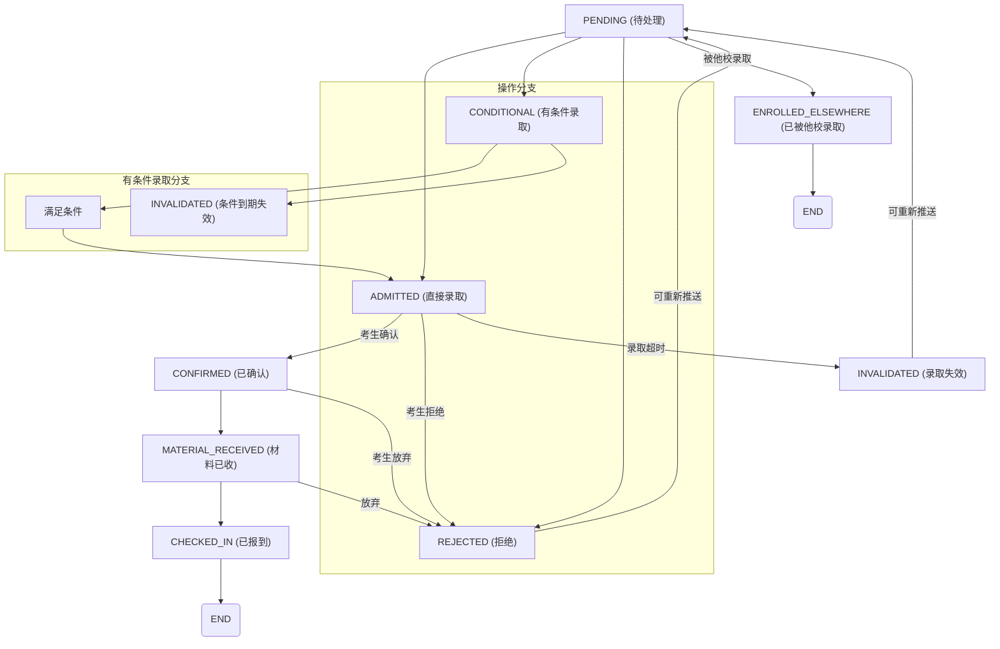
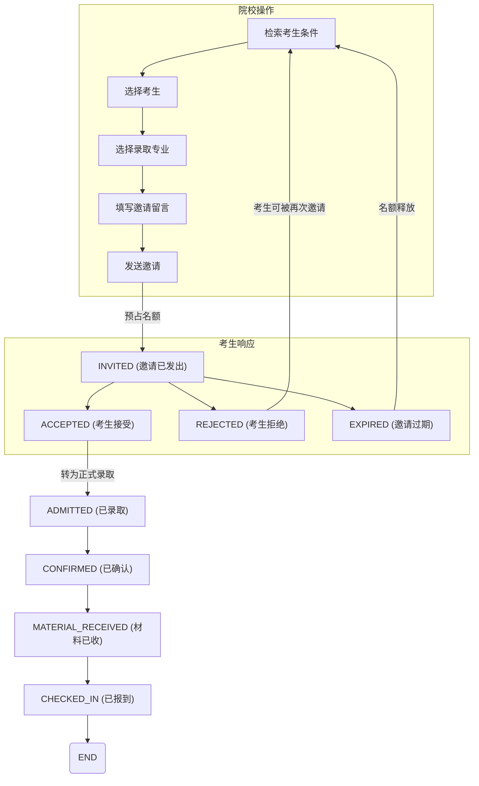
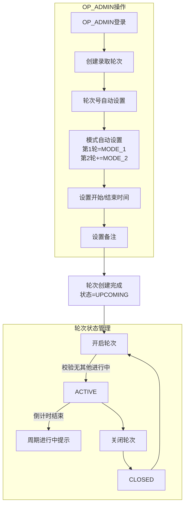
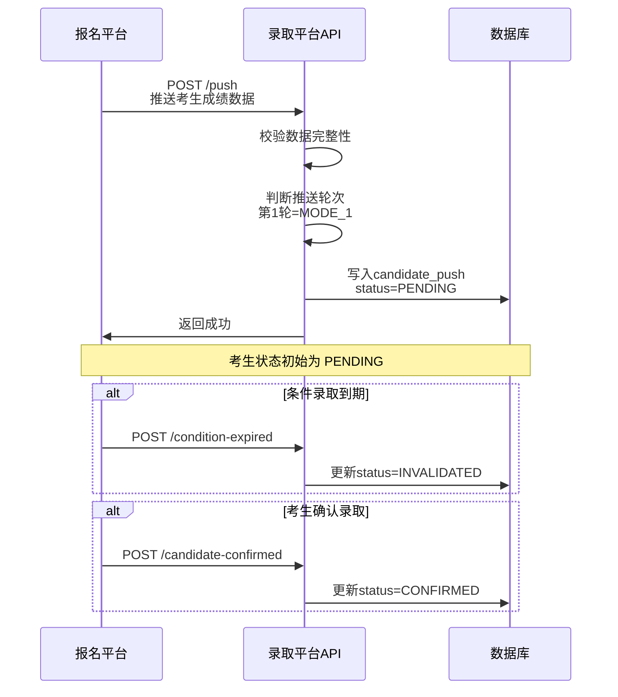
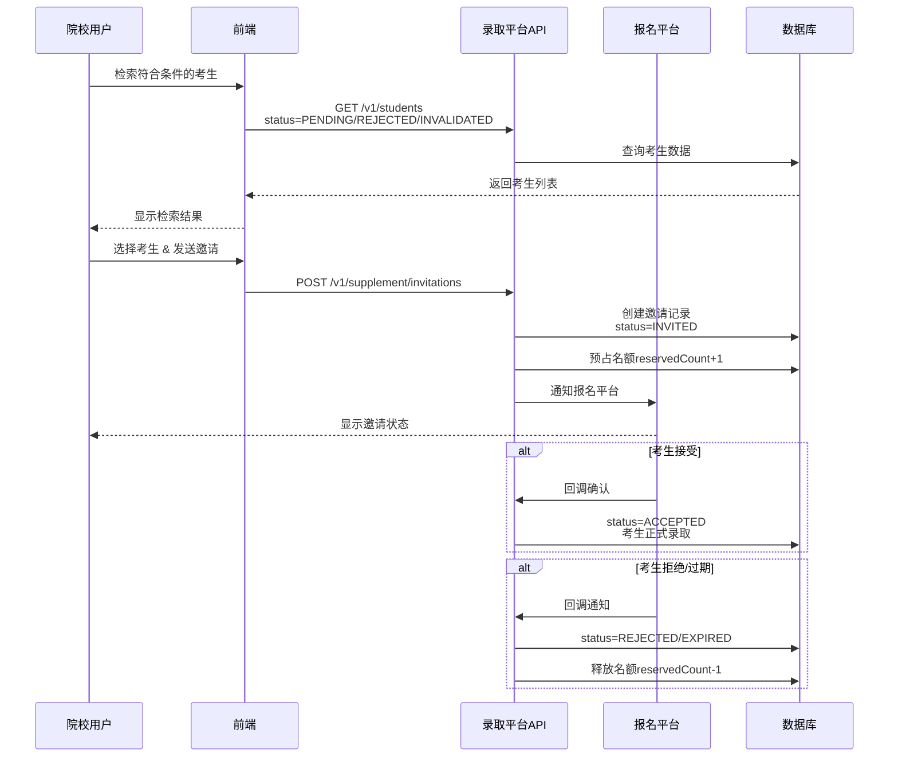
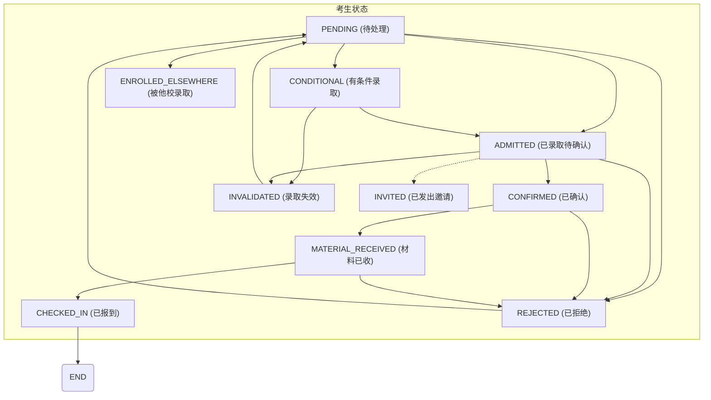

# 补录管理流程图

## 1. 整体录取流程

## 2. 轮次生命周期

## 3. 模式一（第1轮）考生状态流转

## 4. 模式二（第2轮）邀请流程

## 5. 补录轮次管理流程

## 6. 考生数据推送流程（外部集成）

## 7. 补录邀请流程（模式二）

## 8. 完整考生状态枚举

## 关键说明

| 概念 | 说明 |
|------|------|
| **MODE_1（第1轮）** | 考生推送模式，报名平台主动推送考生数据，院校处理录取 |
| **MODE_2（第2轮+）** | 邀请模式，院校主动检索并邀请符合条件考生 |
| **UPCOMING** | 轮次已创建但未开启 |
| **ACTIVE** | 轮次进行中 |
| **CLOSED** | 轮次已结束 |
| **INVITED** | 模式二下，院校已向考生发送录取邀请 |
| **canBeInvited()** | 只有 PENDING/REJECTED/INVALIDATED 状态的考生可被邀请 |
